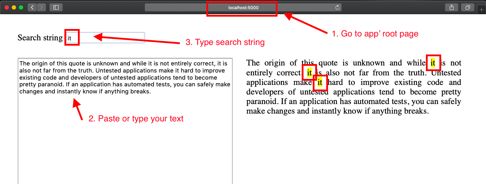

Highlighter
===

Sample Python application that demonstrate the possibility to find and mark text sequence in web page

## Install dependencies
To install dependencies run:
```buildoutcfg
pip install -r requirements.txt
```

## Install package
To install highlighter:
```buildoutcfg
pip install -e .
```

## How to run
To run highlighter app (On Windows use **set** instead of **export**):
```buildoutcfg
export FLASK_APP=highlighter
flask run
```

then go to [localhost:5000](localhost:5000)


## Tests
The application contains tests. To run tests:
```buildoutcfg
pytest -v
```

## Code style check
Code **must** satisfy [PEP008](https://www.python.org/dev/peps/pep-0008/) code style requirements

```buildoutcfg
pylint -r y **/*.py
```
## TODO

 - Create **dev** branch. You can do it either via Pycharm' menu (see the Pycharm how to for details) or via terminal like this:
 ```buildoutcfg
 git checkout master
 git pull
 git checkout -b dev
```
 - Add an implementation to methods in the **\_\_init__.py** module that covers the demands
    - markup_text
    - highlight_text
 - Add tests to the implemented methods in the **tests/test_highlighter.py** module. You can find examples of tests on [Flask testing howto](http://flask.pocoo.org/docs/1.0/testing/) page.
 - Run tests
 - Run code check
 - Commit and push your local changes to the remote **git** repository. You can do it either via Pycharm view (**Ctrl + K**) or via terminal 
 ```buildoutcfg
git commit -a -m 'type your commit message here'
git push origin dev
```
 - Create **MR** (merge request). See how to do it [here](https://docs.gitlab.com/ee/gitlab-basics/add-merge-request.html)
 - Send the link to the **MR** to your reviewer
 
